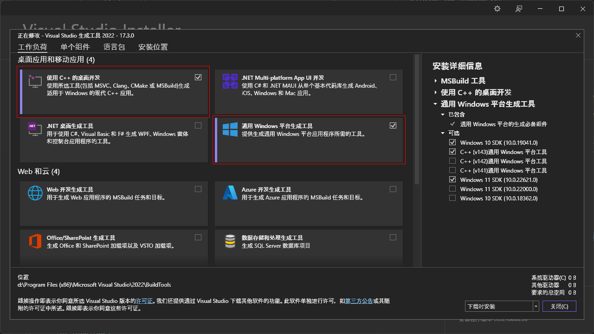
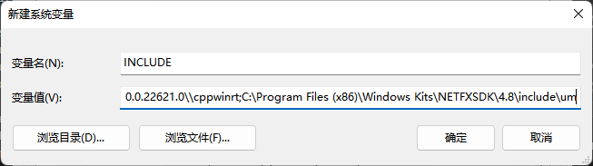

# Use `cl` as global compiler

This tutorial records the process to configure global `C/C++` development environment base on `cl.exe` compiler provided by `Build Tools for Visual Studio`.

## Motivation

`Visual Studio` is a powerful but cumbersome IDE, for which it is lack of attraction personally. One solution is to use only the `Build Tools for Visual Studio` which provide complete development experience (compiler, build system, libs, head files, etc.) on Windows independently.

## Tutorial

Please follow the instructions below to configure the development environment properly.

### Install `Build Tools for Visual Studio`

Download and launch [Build Tools for Visual Studio \<year\>](https://visualstudio.microsoft.com/downloads/#build-tools-for-visual-studio-2022)（中文：Visual Studio \<年份\> 生成工具）. Select and install the following two components.


### Set environment variables

Although not recommend by the official document [Use the Microsoft C++ toolset from the command line | Microsoft Docs](https://docs.microsoft.com/en-us/cpp/build/building-on-the-command-line?view=msvc-160#path_and_environment),
>We don't recommend you set these variables in the Windows environment yourself.

we have to set a batch of environment variables manually in order to use compiler, build system, libs, head files, etc. globally. In the same section of the official document, it says
>The MSVC command-line tools use the `PATH`, `TMP`, `INCLUDE`, `LIB`, and `LIBPATH` environment variables, and also use other environment variables specific to your installed tools, platforms, and SDKs.

In practice, although I ignored the setting of env variable `TMP`, everything works safe and sound so far. Find and start `x64 Native Tools Command Prompt for VS 2022` (or any other command prompt you want to use) in your start menu. Run

```shell
set
```

This command prints all environment variables would be used by the build tools. Find the entry of `INCLUDE` (! not `INCLUD`), `LIB`, and `LIBPATH`. And set them to system environment variable manually. For example, I got the following `INCLUDE` entry

```shell
INCLUDE=d:\Program Files (x86)\Microsoft Visual Studio\2022\BuildTools\VC\Tools\MSVC\14.33.31629\include;d:\Program Files (x86)\Microsoft Visual Studio\2022\BuildTools\VC\Auxiliary\VS\include;C:\Program Files (x86)\Windows Kits\10\include\10.0.22621.0\ucrt;C:\Program Files (x86)\Windows Kits\10\\include\10.0.22621.0\\um;C:\Program Files (x86)\Windows Kits\10\\include\10.0.22621.0\\shared;C:\Program Files (x86)\Windows Kits\10\\include\10.0.22621.0\\winrt;C:\Program Files (x86)\Windows Kits\10\\include\10.0.22621.0\\cppwinrt;C:\Program Files (x86)\Windows Kits\NETFXSDK\4.8\include\um;d:\Program Files (x86)\Microsoft Visual Studio\2022\BuildTools\VC\Tools\MSVC\14.33.31629\include;d:\Program Files (x86)\Microsoft Visual Studio\2022\BuildTools\VC\Auxiliary\VS\include;C:\Program Files (x86)\Windows Kits\10\include\10.0.22621.0\ucrt;C:\Program Files (x86)\Windows Kits\10\\include\10.0.22621.0\\um;C:\Program Files (x86)\Windows Kits\10\\include\10.0.22621.0\\shared;C:\Program Files (x86)\Windows Kits\10\\include\10.0.22621.0\\winrt;C:\Program Files (x86)\Windows Kits\10\\include\10.0.22621.0\\cppwinrt;C:\Program Files (x86)\Windows Kits\NETFXSDK\4.8\include\um
```

Copy and paste variable name & value relatively to create an environment variable.



Repeat the process to create env variables for `LIB` and `LIBPATH`. As for `PATH`, command `set` prints complete but tedious directories, which is unnecessary for me. So I add directories of `MSBuild.exe`, `cl.exe` and `rc.exe` to system `Path` manually. In my case, they are

```shell
D:\Program Files (x86)\Microsoft Visual Studio\2022\BuildTools\MSBuild\Current\Bin # MSBuild.exe
D:\Program Files (x86)\Microsoft Visual Studio\2022\BuildTools\VC\Tools\MSVC\14.33.31629\bin\Hostx64\x64 # cl.exe
D:\Program Files (x86)\Microsoft Visual Studio\Shared\NuGetPackages\microsoft.windows.sdk.buildtools\10.0.22621.1\bin\10.0.22621.0\x64 # rc.exe
```

Save the changes and open a new terminal (powershell, cmd, etc.).

```shell
$ MSBuild.exe  --version
MSBuild version 17.3.0+f67e3d35e for .NET Framework
17.3.0.37102

$ cl.exe
用于 x64 的 Microsoft (R) C/C++ 优化编译器 19.33.31629 版
版权所有(C) Microsoft Corporation。保留所有权利。

用法: cl [ 选项... ] 文件名... [ /link 链接选项... ]

$ rc.exe /?

Microsoft (R) Windows (R) Resource Compiler Version 10.0.10011.16384
Copyright (C) Microsoft Corporation.  All rights reserved.

Usage:  rc [options] .RC input file
<rest outputs>
```

You are now all set to call these tools world-wide.

### Test

Install `cmake` and make sure it can be called from command line.

```shell
$ cmake --version
cmake version 3.23.2

CMake suite maintained and supported by Kitware (kitware.com/cmake).
```

Enter the directory of the simple test program.

```shell
cd hello
```

Here are two files -- `helloworld.cpp` with the following code

```c++
#include <iostream>

int main() {
  std::cout << "Hello World!" << std::endl;
  return 0;
}
```

and corresponding `CMakeLists.txt`

```cmake
cmake_minimum_required(VERSION 3.20)

project(hello)
set(CMAKE_CXX_STANDARD 20) 

add_executable(hello helloworld.cpp)

target_link_libraries(hello)
```

There are many choices of build systems. This tutorial takes `MSBuild` and `ninja` for examples.

#### MSBuild

Create a folder for build files.

```shell
mkdir msbuild;cd msbuild
```

Generate build files using `cmake`. The path `..` points to where `CMakeLists.txt` is.

```shell
cmake .. -G"Visual Studio 17 2022"
```

If you don't know what are available `Generator` values of `-G`, run

```shell
$ cmake -G
CMake Error: No generator specified for -G

Generators
* Visual Studio 17 2022        = Generates Visual Studio 2022 project files.
                                 Use -A option to specify architecture.
  Visual Studio 16 2019        = Generates Visual Studio 2019 project files.
                                 Use -A option to specify architecture.
  Visual Studio 15 2017 [arch] = Generates Visual Studio 2017 project files.
                                 Optional [arch] can be "Win64" or "ARM".
  Visual Studio 14 2015 [arch] = Generates Visual Studio 2015 project files.
                                 Optional [arch] can be "Win64" or "ARM".
  Visual Studio 12 2013 [arch] = Generates Visual Studio 2013 project files.
                                 Optional [arch] can be "Win64" or "ARM".
  Visual Studio 11 2012 [arch] = Generates Visual Studio 2012 project files.
                                 Optional [arch] can be "Win64" or "ARM".
  Visual Studio 10 2010 [arch] = Deprecated.  Generates Visual Studio 2010
                                 project files.  Optional [arch] can be
                                 "Win64" or "IA64".
  Visual Studio 9 2008 [arch]  = Generates Visual Studio 2008 project files.
                                 Optional [arch] can be "Win64" or "IA64".
  Borland Makefiles            = Generates Borland makefiles.
  NMake Makefiles              = Generates NMake makefiles.
  NMake Makefiles JOM          = Generates JOM makefiles.
  MSYS Makefiles               = Generates MSYS makefiles.
  MinGW Makefiles              = Generates a make file for use with
                                 mingw32-make.
  Green Hills MULTI            = Generates Green Hills MULTI files
                                 (experimental, work-in-progress).
  Unix Makefiles               = Generates standard UNIX makefiles.
  Ninja                        = Generates build.ninja files.
  Ninja Multi-Config           = Generates build-<Config>.ninja files.
  Watcom WMake                 = Generates Watcom WMake makefiles.
  CodeBlocks - MinGW Makefiles = Generates CodeBlocks project files.
  CodeBlocks - NMake Makefiles = Generates CodeBlocks project files.
  CodeBlocks - NMake Makefiles JOM
                               = Generates CodeBlocks project files.
  CodeBlocks - Ninja           = Generates CodeBlocks project files.
  CodeBlocks - Unix Makefiles  = Generates CodeBlocks project files.
  CodeLite - MinGW Makefiles   = Generates CodeLite project files.
  CodeLite - NMake Makefiles   = Generates CodeLite project files.
  CodeLite - Ninja             = Generates CodeLite project files.
  CodeLite - Unix Makefiles    = Generates CodeLite project files.
  Eclipse CDT4 - NMake Makefiles
                               = Generates Eclipse CDT 4.0 project files.
  Eclipse CDT4 - MinGW Makefiles
                               = Generates Eclipse CDT 4.0 project files.
  Eclipse CDT4 - Ninja         = Generates Eclipse CDT 4.0 project files.
  Eclipse CDT4 - Unix Makefiles= Generates Eclipse CDT 4.0 project files.
  Kate - MinGW Makefiles       = Generates Kate project files.
  Kate - NMake Makefiles       = Generates Kate project files.
  Kate - Ninja                 = Generates Kate project files.
  Kate - Unix Makefiles        = Generates Kate project files.
  Sublime Text 2 - MinGW Makefiles
                               = Generates Sublime Text 2 project files.
  Sublime Text 2 - NMake Makefiles
                               = Generates Sublime Text 2 project files.
  Sublime Text 2 - Ninja       = Generates Sublime Text 2 project files.
  Sublime Text 2 - Unix Makefiles
                               = Generates Sublime Text 2 project files.
```

Now build

```shell
MSBuild.exe -m .\ALL_BUILD.vcxproj
```

For `-m`, see [Building Multiple Projects in Parallel with MSBuild - MSBuild | Microsoft Docs](https://docs.microsoft.com/en-us/visualstudio/msbuild/building-multiple-projects-in-parallel-with-msbuild?view=vs-2022#-maxcpucount-switch).

Run the executable program.

```shell
$ .\Debug\hello.exe
Hello World!
```

#### Ninja

Assume that you have install `ninja` properly.

```shell
$ ninja --version
1.11.0
```

Create a folder for build files.

```shell
mkdir ninjabuild;cd ninjabuild
```

Set the generator to `ninja`

```shell
cmake .. -GNinja
```

Build

```shell
ninja
```

Run the executable program.

```shell
$ ./hello.exe
Hello World!
```
